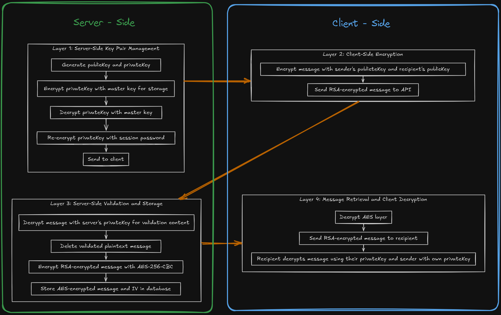

# kimikall_API

Developed project using MERN stack. Authenticated users can send encrypted messages with double-layer
security (E2EE and AES-256-CBC with IV). API supports user registration with email verification, password recovery, and CRUD operations for user profiles. Integrated a token-based system allowing unlimited messaging for premium users. Implemented various security measures to ensure data integrity and prevent abuse.

## Encryption diagram

## END ROUTES

- **MESSAGES** {headers : Authorization} (key token)
    - **READ MESSAGES** _GET_
        - {params: contact} (userId)
    - **READ OLDER MESSAGES** _GET_
        - {params: contact/lastDate} (userId)
    * **COUNT UNREAD MESSAGES** _GET_
    * **CHECK READ MESSAGES** _PATCH_
        - {params: message} (messageId)
    + **SEND MESSAGE** _POST_
        - {payload:{recep,message}} (userId, string message)
    
* **PRIVACY** {headers : Authorization} (key token)
    - **REPORT ACOUNT**  _POST_
        - {payload:{reportUser,problem}} (userId, string message)
    * **BLOCK ACOUNT**  _POST_
        - {payload:{blockUser}} (userId)
    * **GET BLOCKED ACOUNTS** _GET_
    + **UNBLOCK ACOUNT**  _POST_
        - {payload:{unblockUser}} (userId)

* **USER** {headers : Authorization} (key token)
    - **ACOUNT**
        - **CREATE USER** _GET_ (no header)
            - {params: userKey} (token Key)
        * **UPDATE USER** _PATCH_
            - {payload:{name,email,pswd}} (string name, string email, string password)
        + **DELETE USER** _DELETE_
            - {payload:{email,pswd}} (string email, string password)
    * **ACCES**
        - **SING UP** _POST_ (no header)
            - {payload:{name,email,pswd}} (string name, string email, string password)
        * **LOG IN** _POST_
            - {payload:{email,pswd}} (string email, string password)
        + **LOG OUT** _POST_
    * **RECOVER ACOUNT**
        - **GET FORGOTEN PASSWORD** _POST_ (no header)
            - {payload:{email}} (string email)
        + **CHANGE FORGOTTEN PASSWORD** _POST_ (no header)
    + **PAIR KEYS**
        - **GET PRIVATE KEY PASSWORD** _GET_

* **PRORFIL** {headers : Authorization} (key token)
    - **UPDATE PROFIL** _POST_
        - {payload:{profile,extended}} (profile object, extended profile object)
    * **UPLOAD IMAGE PROFILE** _POST_
        - {params: imageType} (string image type)
        + {file:image} (file image)
    * **DELETE IMAGE PROFILE** _GET_
        - {params: imageType} (string image type)
    * **GET OWN PROFIL** _GET_
    + **GET CONTACT PROFIL** _GET_
        - {params: contact} (userId)

* **CONTACTS** {headers : Authorization} (key token)
    - **ADD CONTACT**  _PATCH_
        - {payload:{newContact}} (userId)
    * **DELTE CONTACT**  _PATCH_
        - {payload:{removeContact}} (userId)
    * **GET CONTACTS** _GET_
    * **REQUEST CONTACTS**  _PATCH_
        - {payload:{newContact}} (userId)
    + **SEARCH CONTACTS**  _PATCH_
        - {payload:{normalSearch,expandedSearch}} (search forms)

+ **PREMIUM** {headers : Authorization} (key token)
    - **COUNT TOKENS** _GET_
    + **PROVISIONAL ADD TOKENS** _GET_
        - {params: tokenType} (string token type)

## WEB SOCKETS

- **FRIEND_REQUEST**
    - **Description :** Notify to an user when receives a new friendship request.
    * **Type :** FRIEND_REQUEST
    + **From :** senderId
* **FRIEND_ACCEPT**
    - **Description :** Notify to an user when a contact accepts friendship.
    * **Type :** FRIEND_ACCEPT
    + **From :** senderId
* **FRIEND_REMOVED**
    - **Description :** Notify to an user when is deleted from contacts list.
    * **Type :** FRIEND_REMOVED
    + **From :** senderId
* **NEW_MESSAGE**
    - **Description :** Notify to an user when receives a new message.
    * **Type :** NEW_MESSAGE
    + **From :** senderId
+ **IS_READ**
    - **Description :** Notify to an user when one message sended is read.
    * **Type :** IS_READ
    + **From :** senderId